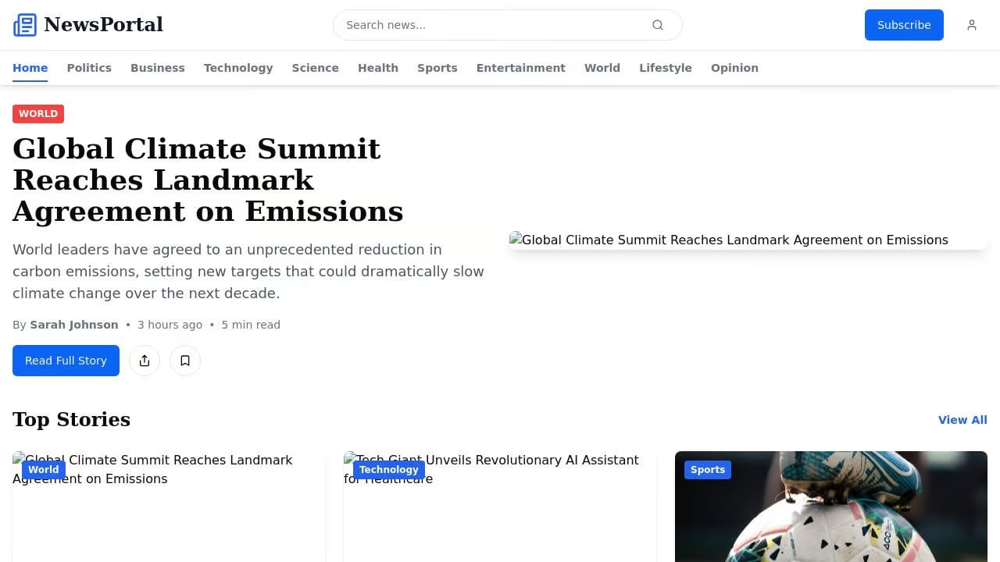

# News Portal

A modern, responsive news portal website with category browsing, article viewing, and search functionality.



## Features

- **Homepage with Featured Articles**: Showcase important news with a featured hero section
- **Category Browsing**: Articles organized by categories (Politics, Business, Technology, etc.)
- **Article View**: Full article display with author information and reading time
- **Search Functionality**: Search across all articles with real-time results
- **Responsive Design**: Optimized for mobile, tablet, and desktop viewing
- **Editor's Picks**: Curated selection of important articles
- **Trending News**: Highlighting popular and trending stories
- **Latest News**: Chronological display of most recent articles

## Technology Stack

### Frontend
- React with TypeScript for UI components
- TanStack Query for data fetching and caching
- Shadcn UI components with Tailwind CSS for styling
- Wouter for client-side routing

### Backend
- Express.js server
- In-memory data storage (MemStorage implementation)
- RESTful API endpoints for data retrieval
- TypeScript for type safety

## Project Structure

```
├── client/                  # Frontend code
│   ├── src/
│   │   ├── components/      # UI components
│   │   ├── hooks/           # Custom React hooks
│   │   ├── lib/             # Utility functions
│   │   ├── pages/           # Page components
│   │   └── types/           # TypeScript interfaces
│   └── index.html           # HTML entry point
├── server/                  # Backend code
│   ├── index.ts             # Server entry point
│   ├── routes.ts            # API route definitions
│   ├── storage.ts           # Data storage implementation
│   └── vite.ts              # Vite server configuration
└── shared/                  # Shared code between frontend and backend
    └── schema.ts            # Data models and types
```

## API Endpoints

- **GET /api/articles**: Get all articles
- **GET /api/articles/:id**: Get article by ID
- **GET /api/articles/slug/:slug**: Get article by slug
- **GET /api/articles/featured**: Get featured articles
- **GET /api/articles/trending**: Get trending articles
- **GET /api/articles/latest**: Get latest articles
- **GET /api/articles/editors-picks**: Get editor's pick articles
- **GET /api/categories**: Get all categories
- **GET /api/categories/:id**: Get category by ID
- **GET /api/categories/slug/:slug**: Get category by slug
- **GET /api/categories/:categoryId/articles**: Get articles by category ID
- **GET /api/search?q=:query**: Search articles by query string

## Development

### Prerequisites
- Node.js 16+ and npm

### Setup Instructions
1. Clone the repository
2. Install dependencies:
   ```
   npm install
   ```
3. Start the development server:
   ```
   npm run dev
   ```
4. Open your browser to `http://localhost:5000`

## Future Enhancements

- User authentication and personalized reading lists
- Comments and social sharing functionality
- Rich text editor for article creation
- Database integration for persistent storage
- Newsletter subscription management
- Related articles recommendations
- Analytics dashboard for content performance